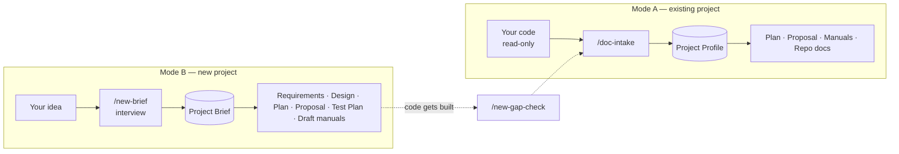

# DocumentationCreator

A Claude Code workspace that produces professional, evidence-based software documentation
in two modes:

| Mode | You have | You give Claude | You get |
|------|----------|-----------------|---------|
| **A — Existing project** | Working or partial code | A project folder path | Completion Plan, Proposal, User / Technical / Developer Manuals, repo docs, all grounded in the code |
| **B — New project** | Only an idea | A description of what you want to build | Project Brief, Requirements Specification, System Design, Project Plan, Proposal, Test Plan, draft manuals |

Nothing is invented. Anything the evidence cannot tell you (budget, deadline, client,
names) is marked `[TBD]`. In Mode B, Claude's own suggestions are labeled **Proposed**,
and choices you must make are marked `[DECISION]`.

## Prerequisites
- [Claude Code](https://claude.com/claude-code) (CLI, desktop app, or IDE extension)
- Mode A: read access to the project you want to document. Optional: `git` (records the
  source revision in each document)

## Quickstart
1. Open this folder in Claude Code:
   ```bash
   cd "D:/1 Project/DocumentationCreator"
   claude
   ```
2. Pick your mode:
   ```text
   /doc-suite D:/path/to/your-project
   ```
   ```text
   /new-suite An online ordering system for a bakery with customer accounts, order tracking, and a daily production report
   ```
3. Answer the questions Claude asks (one round), or reply `continue` / `use defaults`.
4. Collect the results from `output/mode-a/<slug>/` or `output/mode-b/<slug>/`.

You can also ask in plain language, for example "Create a user manual for the project in
D:/work/inventory-system" (Mode A) or "I want to build a leave request system for our HR
team, create the documents" (Mode B). The matching skills trigger automatically.

## Commands

### Mode A — Existing project (`doc-*`)
| Command | What it does | Output |
|---------|--------------|--------|
| `/doc-intake <path> [name]` | Analyzes the code and builds the evidence base | `00-project-profile.md` |
| `/doc-plan <slug> [deadline/team]` | Project Completion Plan | `01-project-completion-plan.md` |
| `/doc-proposal <slug> [client/budget]` | Project Proposal | `02-project-proposal.md` |
| `/doc-user-manual <slug> [roles]` | User Manual | `03-user-manual.md` |
| `/doc-technical-manual <slug> [env]` | Technical Manual | `04-technical-manual.md` |
| `/doc-developer-manual <slug>` | Developer Manual | `05-developer-manual.md` |
| `/doc-repo-files <slug> [readme\|architecture\|api\|all]` | GitHub-style repo docs | `repo/*.md` |
| `/doc-suite <path> [--only ...] [--format docx\|pdf]` | All of the above, plus a consistency review | everything + `INDEX.md` |

### Mode B — New project (`new-*`)
| Command | What it does | Output |
|---------|--------------|--------|
| `/new-brief <idea> [name]` | Interviews you once and records the idea | `00-project-brief.md` |
| `/new-requirements <slug>` | Software Requirements Specification | `01-requirements-specification.md` |
| `/new-design <slug> [stack/hosting]` | System Design Document | `02-system-design.md` |
| `/new-plan <slug> [start/deadline/team]` | Project Plan (build from zero) | `03-project-plan.md` |
| `/new-proposal <slug> [client/budget/rates]` | Project Proposal (new system) | `04-project-proposal.md` |
| `/new-test-plan <slug>` | Test Plan with UAT scenarios | `05-test-plan.md` |
| `/new-manuals <slug> [user\|technical\|developer\|all]` | Draft manuals for the planned system | `06`–`08` |
| `/new-suite <idea> [--only ...] [--no-manuals] [--format docx\|pdf]` | All of the above, plus a traceability review | everything + `INDEX.md` |
| `/new-gap-check <slug> <code-path>` | After the build: planned vs built | `09-gap-report.md` |

### Examples
```text
/doc-intake D:/work/inventory-system "Inventory Management System"
/doc-plan inventory-management-system deadline 2026-12-15, 2 developers, 2-week sprints
/doc-suite D:/work/inventory-system --only user,technical --format docx

/new-brief A mobile-friendly web app for field technicians to log site visits with photos
/new-plan field-visit-tracker start 2026-11-02, 3 developers, deadline 2027-03-31
/new-suite A leave request and approval system for 150 employees --format docx
/new-gap-check field-visit-tracker D:/work/field-visit-tracker
```

## How It Works



1. **Evidence base:** Mode A scans the code into a **Project Profile**. Mode B interviews
   you into a **Project Brief**. Every other document reuses these facts.
2. **Documents:** each skill fills its template. Mode A cites code (`path:line`). Mode B
   traces everything to requirement IDs (`FR-01`, `NFR-01`).
3. **Review:** every document passes `rules/50-review-checklist.md`. The suites also check
   cross-document consistency (and, in Mode B, requirement traceability).

### Markers
| Marker | Meaning |
|--------|---------|
| `[TBD: ...]` | Not in the evidence. A human must supply it (budget, dates, names). |
| `[ASSUMPTION: ...]` | Inferred, so please confirm. |
| `[VERIFY: ...]` | Sources conflict, may be stale, or must be confirmed after the build. |
| `[DECISION: ...]` | Mode B: you must choose between options. A recommendation is given. |
| **Proposed** | Mode B: Claude's suggestion, with a reason. |

Each document ends with an **Open Items** table. `INDEX.md` consolidates them all.

## Repository Structure

```text
DocumentationCreator/
├── CLAUDE.md                     # Master instructions (both modes, imports all rules)
├── README.md                     # This file
├── rules/                        # Shared rules (both modes)
│   ├── 00-core-principles.md
│   ├── 10-writing-style.md
│   ├── 20-formatting.md
│   └── 50-review-checklist.md
├── mode-a-existing-project/      # MODE A — document existing code
│   ├── README.md
│   ├── rules/                    #   30 evidence (code), 40 document rules
│   └── templates/                #   00-profile … 05-developer-manual, repo/
├── mode-b-new-project/           # MODE B — document a project before it is built
│   ├── README.md
│   ├── rules/                    #   30 evidence (brief), 40 document rules
│   └── templates/                #   00-brief … 05-test-plan, 09-gap-report
├── .claude/skills/
│   ├── doc-*/                    #   Mode A skills (intake, plan, proposal, manuals, repo, suite)
│   └── new-*/                    #   Mode B skills (brief, requirements, design, plan, proposal,
│                                 #   test-plan, manuals, suite, gap-check)
├── projects/                     # (optional) drop Mode A projects here
└── output/
    ├── mode-a/<project-slug>/    # Generated Mode A documentation
    └── mode-b/<project-slug>/    # Generated Mode B documentation
```

## Architecture Summary

| Module | Responsibility |
|--------|----------------|
| `CLAUDE.md` | Entry point. Defines both modes and the workflow, and imports the rules |
| `rules/` | Shared standards: principles, style, formatting, QA checklist |
| `mode-a-existing-project/` | Mode A templates and evidence rules (code is the source of truth) |
| `mode-b-new-project/` | Mode B templates and evidence rules (the brief is the source of truth) |
| `.claude/skills/` | Step-by-step procedures Claude runs for each document |
| `projects/` | Mode A input staging area (read-only to Claude) |
| `output/` | Generated documents, assets, and exports, separated by mode |

## Customizing
- **Change the house style or sections:** edit the templates in
  `mode-a-existing-project/templates/` or `mode-b-new-project/templates/`.
- **Change writing standards:** edit `rules/` (shared) or the mode's own `rules/` folder.
  They load automatically through `CLAUDE.md`.
- **Add a new document type:** add a template to the mode's `templates/`, add
  `.claude/skills/<name>/SKILL.md` (copy an existing skill of the same mode), add a
  section to that mode's `rules/40-document-specific.md`, and register it in `CLAUDE.md`
  and in the mode's suite skill (`doc-suite` or `new-suite`).
- **Word/PDF output:** pass `--format docx` or `--format pdf` to either suite, or ask
  "export the proposal to Word".

## Tips for Best Results
- Give business context up front (client, purpose, deadline, team size, budget). It
  turns most `[TBD]`s in the Plan and Proposal into real content.
- Mode B: the more detail in your idea (users, must-have features, platform), the fewer
  interview questions. Attach existing forms or spreadsheets. They are good evidence.
- Mode A: permission to run the app lets Claude capture real screenshots for the User Manual.
- From B to A: when development is done, run `/new-gap-check`, then `/doc-suite` on the
  code for the final manuals.
