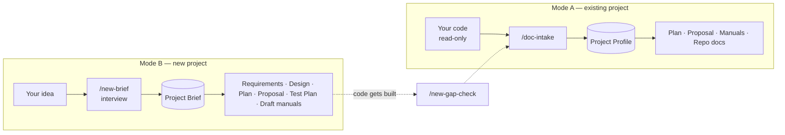

# DocumentationCreator

[](https://github.com/strugz/DocumentationCreator/actions/workflows/tests.yml)
[](LICENSE)

A Claude Code workspace that produces professional, evidence-based software documentation
in two modes:

| Mode | You have | You give Claude | You get |
|------|----------|-----------------|---------|
| **A — Existing project** | Working or partial code | A project folder path | Completion Plan, Proposal, User / Technical / Developer Manuals, repo docs, all grounded in the code |
| **B — New project** | Only an idea | A description of what you want to build | Project Brief, Requirements Specification, System Design, Project Plan, Proposal, Test Plan, draft manuals |

Nothing is invented. Anything the evidence cannot tell you (budget, deadline, client,
names) is marked `[TBD]`. In Mode B, Claude's own suggestions are labeled **Proposed**,
and choices you must make are marked `[DECISION]`.

## Prerequisites
| Tool | Needed for | Required? |
|------|------------|-----------|
| [Claude Code](https://claude.com/claude-code) (CLI, desktop app, or IDE extension) | Running the skills. Other AI agents work too; see [Using Other AI Tools](#using-other-ai-tools) | Yes, or another agent |
| Python 3.9 or later | The document linter and its auto-lint hook (`tools/lint_docs.py`) | Yes |
| `git` | Recording the source revision in Mode A documents | Optional |
| Node.js 18 or later | Exporting documents to Word (`tools/md_to_docx.js`) | Optional |

Mode A also needs read access to the project you want to document.

## Installation
1. Clone the repository:
   ```bash
   git clone https://github.com/strugz/DocumentationCreator.git
   ```
2. Optional: install the Word export dependency:
   ```bash
   cd DocumentationCreator/tools && npm install
   ```
3. Open the `DocumentationCreator` folder in Claude Code. The skills in `.claude/skills/`
   and the lint hook in `.claude/settings.json` load automatically. The first time, Claude
   Code asks you to trust the folder and approve the project hook.

The linter uses only the Python standard library, so there is nothing to `pip install`.

## Quickstart
1. Open this folder in Claude Code (or open it in the desktop app):
   ```bash
   cd DocumentationCreator
   claude
   ```
2. Pick your mode:
   ```text
   /doc-suite D:/path/to/your-project
   ```
   ```text
   /new-suite An online ordering system for a bakery with customer accounts, order tracking, and a daily production report
   ```
3. Answer the questions Claude asks (one round), or reply `continue` / `use defaults`.
4. Collect the results from `output/mode-a/<slug>/` or `output/mode-b/<slug>/`.

> [!NOTE]
> Generated documents are ignored by git (see `.gitignore`), so your project and client
> documents stay on your machine. Only the empty `output/mode-a/` and `output/mode-b/`
> folders are tracked. To keep your documents in version control, store them in a
> separate private repository.

You can also ask in plain language, for example "Create a user manual for the project in
D:/work/inventory-system" (Mode A) or "I want to build a leave request system for our HR
team, create the documents" (Mode B). The matching skills trigger automatically.

## Commands

### Mode A — Existing project (`doc-*`)
| Command | What it does | Output |
|---------|--------------|--------|
| `/doc-intake <path> [name]` | Analyzes the code and builds the evidence base | `00-project-profile.md` |
| `/doc-plan <slug> [deadline/team]` | Project Completion Plan | `01-project-completion-plan.md` |
| `/doc-proposal <slug> [client/budget]` | Project Proposal | `02-project-proposal.md` |
| `/doc-user-manual <slug> [roles]` | User Manual | `03-user-manual.md` |
| `/doc-technical-manual <slug> [env]` | Technical Manual | `04-technical-manual.md` |
| `/doc-developer-manual <slug>` | Developer Manual | `05-developer-manual.md` |
| `/doc-repo-files <slug> [readme\|architecture\|api\|all]` | GitHub-style repo docs | `repo/*.md` |
| `/doc-suite <path> [--only ...] [--format docx\|pdf]` | All of the above, plus a consistency review | everything + `INDEX.md` |

### Mode B — New project (`new-*`)
| Command | What it does | Output |
|---------|--------------|--------|
| `/new-brief <idea> [name]` | Interviews you once and records the idea | `00-project-brief.md` |
| `/new-requirements <slug>` | Software Requirements Specification | `01-requirements-specification.md` |
| `/new-design <slug> [stack/hosting]` | System Design Document | `02-system-design.md` |
| `/new-plan <slug> [start/deadline/team]` | Project Plan (build from zero) | `03-project-plan.md` |
| `/new-proposal <slug> [client/budget/rates]` | Project Proposal (new system) | `04-project-proposal.md` |
| `/new-test-plan <slug>` | Test Plan with UAT scenarios | `05-test-plan.md` |
| `/new-manuals <slug> [user\|technical\|developer\|all]` | Draft manuals for the planned system | `06`–`08` |
| `/new-suite <idea> [--only ...] [--no-manuals] [--format docx\|pdf]` | All of the above, plus a traceability review | everything + `INDEX.md` |
| `/new-gap-check <slug> <code-path>` | After the build: planned vs built | `09-gap-report.md` |

### Examples
```text
/doc-intake D:/work/inventory-system "Inventory Management System"
/doc-plan inventory-management-system deadline 2026-12-15, 2 developers, 2-week sprints
/doc-suite D:/work/inventory-system --only user,technical --format docx

/new-brief A mobile-friendly web app for field technicians to log site visits with photos
/new-plan field-visit-tracker start 2026-11-02, 3 developers, deadline 2027-03-31
/new-suite A leave request and approval system for 150 employees --format docx
/new-gap-check field-visit-tracker D:/work/field-visit-tracker
```

## How It Works



1. **Evidence base:** Mode A scans the code into a **Project Profile**. Mode B interviews
   you into a **Project Brief**. Every other document reuses these facts.
2. **Documents:** each skill fills its template. Mode A cites code (`path:line`). Mode B
   traces everything to requirement IDs (`FR-01`, `NFR-01`).
3. **Review:** every document passes `rules/50-review-checklist.md`. The suites also check
   cross-document consistency (and, in Mode B, requirement traceability).

### Markers
| Marker | Meaning |
|--------|---------|
| `[TBD: ...]` | Not in the evidence. A human must supply it (budget, dates, names). |
| `[ASSUMPTION: ...]` | Inferred, so please confirm. |
| `[VERIFY: ...]` | Sources conflict, may be stale, or must be confirmed after the build. |
| `[DECISION: ...]` | Mode B: you must choose between options. A recommendation is given. |
| **Proposed** | Mode B: Claude's suggestion, with a reason. |

Each document ends with an **Open Items** table. `INDEX.md` consolidates them all.

## Automated Checks

`tools/lint_docs.py` checks the mechanical parts of the review checklist so the model
does not have to grade itself on them:

| Check | What it catches |
|-------|-----------------|
| structure | Missing Document Control fields, H1 count, skipped heading levels, Table of Contents gaps, missing Open Items / Revision History |
| markers | `[TBD]` / `[ASSUMPTION]` / `[VERIFY]` / `[DECISION]` markers that are not listed in Open Items |
| placeholders | Unfilled `{{...}}` template placeholders, leftover template comments |
| code / mermaid | Code blocks without a language tag, unclosed fences, invalid or oversized Mermaid diagrams |
| links | `#anchors` that match no heading |
| secrets | Passwords, keys, tokens, connection strings with credentials |
| citations (Mode A) | `path:line` references to files or lines that do not exist in the source |
| ids / trace (Mode B) | Undefined `F-xx` / `FR-xx` references; Must/Should requirements missing from the Design, Plan, Test Plan, or Traceability Matrix |

It runs automatically after every document write (hook in `.claude/settings.json`). You
can also run it yourself:

```bash
python tools/lint_docs.py output/mode-b/my-app
```

```bash
python -m unittest discover -s tests
```

## Exporting to Word
Markdown is the master format. To produce `.docx` files from a finished output folder:

```bash
node tools/md_to_docx.js output/mode-b/my-app
```

The files are written to `output/<mode>/<slug>/export/`. Mermaid diagrams appear as source
with a note, and review markers are highlighted. For PDF, open the `.docx` in Word and save
as PDF. The suites do this for you when you pass `--format docx` or `--format pdf`.

## Measuring Quality (Evals)
If you change a rule, template, or skill, run the eval set before and after the change
and compare the scores. Two fixture cases (one per mode) test that Claude does not invent
features, copy secrets, or fill in budgets it was never given.

```bash
python evals/run_evals.py run all
```

See [`evals/README.md`](evals/README.md) for the scoring layers and the baseline.

> [!NOTE]
> `evals/cases/a-tasktrack/project/.env` contains **fake, deliberately planted** secrets.
> The eval checks that they never appear in generated documents. They are not real
> credentials.

## Repository Structure

```text
DocumentationCreator/
├── CLAUDE.md                     # Master instructions (both modes, imports all rules)
├── AGENTS.md                     # Same instructions for other AI agents (Codex and others)
├── README.md                     # This file
├── rules/                        # Shared rules (both modes)
│   ├── 00-core-principles.md
│   ├── 10-writing-style.md
│   ├── 20-formatting.md
│   └── 50-review-checklist.md
├── mode-a-existing-project/      # MODE A — document existing code
│   ├── README.md
│   ├── rules/                    #   30 evidence (code), 40 document rules
│   └── templates/                #   00-profile … 05-developer-manual, repo/
├── mode-b-new-project/           # MODE B — document a project before it is built
│   ├── README.md
│   ├── rules/                    #   30 evidence (brief), 40 document rules
│   └── templates/                #   00-brief … 05-test-plan, 09-gap-report
├── .claude/skills/
│   ├── doc-*/                    #   Mode A skills (intake, plan, proposal, manuals, repo, suite)
│   └── new-*/                    #   Mode B skills (brief, requirements, design, plan, proposal,
│                                 #   test-plan, manuals, suite, gap-check)
├── tools/
│   ├── lint_docs.py              # Automated Rule 50 checks (run on any output folder)
│   ├── md_to_docx.js             # Markdown → Word export (needs `npm install` in tools/)
│   └── hooks/lint_on_write.py    # Hook: lints each document as Claude writes it
├── evals/                        # Eval cases, grader, and baseline scores
├── tests/                        # Unit tests for the linter and grader
├── .claude/settings.json         # Registers the lint hook (shared with the team)
├── projects/                     # (optional) drop Mode A projects here
└── output/                       # Generated documents (git-ignored)
    ├── mode-a/<project-slug>/    # Generated Mode A documentation
    └── mode-b/<project-slug>/    # Generated Mode B documentation
```

## Architecture Summary

| Module | Responsibility |
|--------|----------------|
| `CLAUDE.md` | Entry point. Defines both modes and the workflow, and imports the rules |
| `rules/` | Shared standards: principles, style, formatting, QA checklist |
| `mode-a-existing-project/` | Mode A templates and evidence rules (code is the source of truth) |
| `mode-b-new-project/` | Mode B templates and evidence rules (the brief is the source of truth) |
| `.claude/skills/` | Step-by-step procedures Claude runs for each document |
| `projects/` | Mode A input staging area (read-only to Claude) |
| `output/` | Generated documents, assets, and exports, separated by mode |
| `tools/` | Deterministic checks (`lint_docs.py`) and the hook that runs them |

## Customizing
- **Change the house style or sections:** edit the templates in
  `mode-a-existing-project/templates/` or `mode-b-new-project/templates/`.
- **Change writing standards:** edit `rules/` (shared) or the mode's own `rules/` folder.
  They load automatically through `CLAUDE.md`.
- **Add a new document type:** add a template to the mode's `templates/`, add
  `.claude/skills/<name>/SKILL.md` (copy an existing skill of the same mode), add a
  section to that mode's `rules/40-document-specific.md`, and register it in `CLAUDE.md`
  and in the mode's suite skill (`doc-suite` or `new-suite`).
- **Word/PDF output:** pass `--format docx` or `--format pdf` to either suite, or ask
  "export the proposal to Word". See [Exporting to Word](#exporting-to-word).

## Tips for Best Results
- Give business context up front (client, purpose, deadline, team size, budget). It
  turns most `[TBD]`s in the Plan and Proposal into real content.
- Mode B: the more detail in your idea (users, must-have features, platform), the fewer
  interview questions. Attach existing forms or spreadsheets. They are good evidence.
- Mode A: permission to run the app lets Claude capture real screenshots for the User Manual.
- From B to A: when development is done, run `/new-gap-check`, then `/doc-suite` on the
  code for the final manuals.

## Using Other AI Tools
The repository is built for Claude Code, but the templates, rules, skills, and tools are
plain Markdown and scripts that any AI coding agent can follow. `AGENTS.md` gives other
agents (for example Codex) the same instructions that `CLAUDE.md` gives Claude Code.

| Feature | Claude Code | Other agents |
|---------|-------------|--------------|
| Project instructions | `CLAUDE.md` loads automatically | Agents that read `AGENTS.md` load it automatically. Otherwise, tell the agent to read `AGENTS.md` first |
| Rules | Imported by `CLAUDE.md` | `AGENTS.md` tells the agent to open each rule file |
| Commands | `/doc-suite <path>`, `/new-suite <idea>`, … | Ask in words, for example "Follow `.claude/skills/doc-suite/SKILL.md` for `D:/work/app`" |
| Linting | Runs automatically after every write (hook) | The agent runs `python tools/lint_docs.py output/<mode>/<slug>` itself |
| Interview questions (Mode B) | Can use a multiple-choice prompt | Asked in a normal chat message |
| Evals | `python evals/run_evals.py run all` | Use the manual route: `prompt`, run it in the agent, then `collect` (see [`evals/README.md`](evals/README.md)) |

> [!NOTE]
> The eval baseline was measured with Claude. Document quality with other agents has not
> been measured. Run the evals with your agent before relying on it.

## Contributing
Contributions are welcome. See [CONTRIBUTING.md](CONTRIBUTING.md) for setup, where each
kind of change lives, and how to test it with the unit tests and evals.

## License
Released under the [MIT License](LICENSE). You may use, copy, modify, and share this
repository, including for commercial work, as long as you keep the copyright notice.
Documents you generate with it belong to you.
