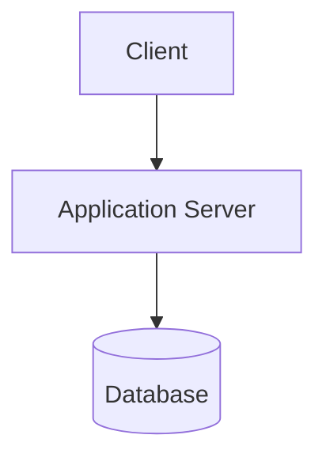

# {{Product Name}} — Technical Manual

| Field | Value |
|-------|-------|
| Project | {{Product Name}} |
| Document | Technical Manual (Installation, Configuration, and Operations) |
| Version | 0.1 (Draft) — applies to {{Product}} v{{x.y}} |
| Date | {{YYYY-MM-DD}} |
| Prepared by | {{name}} |
| Status | Draft |
| Source revision | {{SHA}} |

## Table of Contents

## 1. Introduction
### 1.1 Purpose and Audience
### 1.2 System Overview
### 1.3 Related Documents
<!-- User Manual, Developer Manual. -->

## 2. System Architecture
### 2.1 Architecture Diagram

### 2.2 Components
| Component | Technology | Role | Port / Endpoint |
|-----------|------------|------|-----------------|
### 2.3 Data Flow
### 2.4 Network and Ports
| Port | Protocol | Component | Exposed to |
|------|----------|-----------|------------|

## 3. System Requirements
### 3.1 Hardware
| Environment | CPU | RAM | Disk |
|-------------|-----|-----|------|
<!-- Use [TBD] or [ASSUMPTION]; do not invent sizing. -->
### 3.2 Software
| Software | Version | Purpose |
|----------|---------|---------|
### 3.3 Accounts and Access Required

## 4. Installation
### 4.1 Pre-Installation Checklist
- [ ] ...
### 4.2 Installation Steps
```bash
# exact, verified commands; name the shell / OS
```
### 4.3 Database Setup and Migrations
### 4.4 Verifying the Installation

## 5. Configuration Reference
### 5.1 Environment Variables
| Variable | Required | Default | Description | Example |
|----------|----------|---------|-------------|---------|
### 5.2 Configuration Files
| File | Purpose | Key settings |
|------|---------|-------------|
### 5.3 Secrets Management
<!-- Where secrets live and how to rotate them. Never include real values. -->

## 6. Deployment
### 6.1 Environments (Dev / Staging / Production)
### 6.2 Deployment Procedure
### 6.3 CI/CD Pipeline Overview
### 6.4 Rollback Procedure

## 7. Administration
### 7.1 User and Role Management
### 7.2 Scheduled Jobs / Background Workers
| Job | Schedule | Purpose | Defined in |
|-----|----------|---------|-----------|
### 7.3 Routine Maintenance Tasks
| Task | Frequency | Procedure |
|------|-----------|-----------|

## 8. Integrations and External Services
| Service | Purpose | Configuration | Failure behavior |
|---------|---------|---------------|-----------------|

## 9. Security
### 9.1 Authentication and Authorization
### 9.2 Data Protection (in transit / at rest)
### 9.3 Hardening Checklist
- [ ] ...
### 9.4 Audit Logging

## 10. Monitoring and Logging
### 10.1 Log Locations and Formats
### 10.2 Health Checks
### 10.3 Key Metrics and Alerts

## 11. Backup and Recovery
### 11.1 What to Back Up
### 11.2 Backup Procedure
### 11.3 Restore Procedure
### 11.4 Disaster Recovery (RTO / RPO: [TBD])

## 12. Troubleshooting
| Symptom | Likely cause | Diagnosis | Resolution |
|---------|-------------|-----------|------------|

## 13. Upgrade Procedure

## Appendix A — Command Reference
## Appendix B — Glossary

## Open Items
| Marker | Item | Needed from |
|--------|------|-------------|

## Revision History
| Version | Date | Author | Changes |
|---------|------|--------|---------|
| 0.1 | {{date}} | {{author}} | Initial draft |
