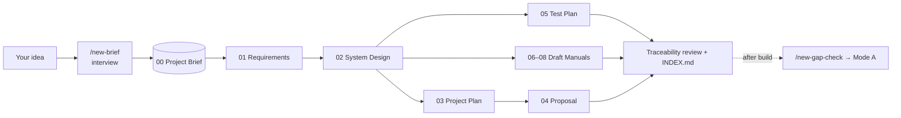

# Mode B — New Project

Use this mode when you have an **idea but no code yet**. Describe the system you want.
Claude interviews you once, writes a Project Brief, and then produces the documents a
team needs **before** development starts. Documents only, no application code.

## Commands
| Command | Output (`output/mode-b/<slug>/`) |
|---------|----------------------------------|
| `/new-brief <idea> [name]` | `00-project-brief.md` (evidence base, from a short interview) |
| `/new-requirements <slug>` | `01-requirements-specification.md` |
| `/new-design <slug> [stack/hosting]` | `02-system-design.md` |
| `/new-plan <slug> [start/deadline/team]` | `03-project-plan.md` |
| `/new-proposal <slug> [client/budget/rates]` | `04-project-proposal.md` |
| `/new-test-plan <slug>` | `05-test-plan.md` |
| `/new-manuals <slug> [user\|technical\|developer\|all]` | `06`–`08` draft manuals |
| `/new-suite <idea> [--only ...] [--no-manuals] [--format docx\|pdf]` | All of the above + `INDEX.md` |
| `/new-gap-check <slug> <code-path>` | `09-gap-report.md` (later, once code exists) |

## Example
```text
/new-suite A web system for our clinic to book patient appointments, send SMS reminders, and let doctors see their daily schedule
```

## How it works


1. **Brief:** Claude asks all its questions in one message, each with a suggested
   default. Answer what you can, or reply `use defaults`.
2. **Documents:** each document builds on the earlier ones. Requirements get IDs
   (`FR-01`, `NFR-01`), and every design component, plan item, and test case traces back
   to them.
3. **After you build it:** run `/new-gap-check` to compare the plan with the code, then
   use the Mode A skills for the final manuals.

## Labels used in Mode B
| Label | Meaning |
|-------|---------|
| **Proposed** | Claude's suggestion (e.g. tech stack), with a reason. Confirm or change it. |
| `[DECISION: ...]` | You must choose between options. Claude gives a recommendation. |
| `[TBD: ...]` | Information still needed (budget, dates, names). |
| `[ASSUMPTION: ...]` | Inferred from what you said. Please confirm. |
| `[VERIFY: ...]` | Possibly inconsistent, or must be confirmed after the build. |

## Contents of this folder
| Path | Purpose |
|------|---------|
| `templates/` | Document skeletons for Mode B (00–05, 09). Draft manuals reuse the Mode A templates. |
| `rules/30-evidence-from-brief.md` | Evidence comes from you; labels, traceability, future tense |
| `rules/40-document-specific.md` | What each Mode B document must contain |

Shared writing, formatting, and review rules live in the top-level `rules/` folder.
