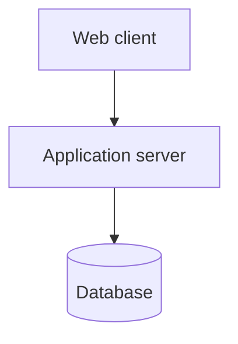
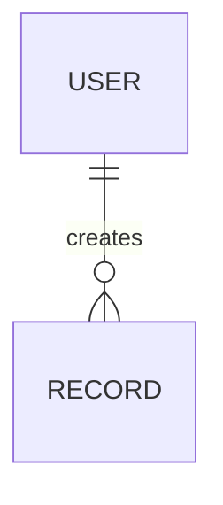
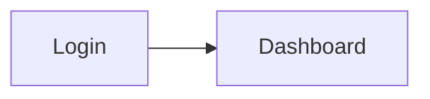
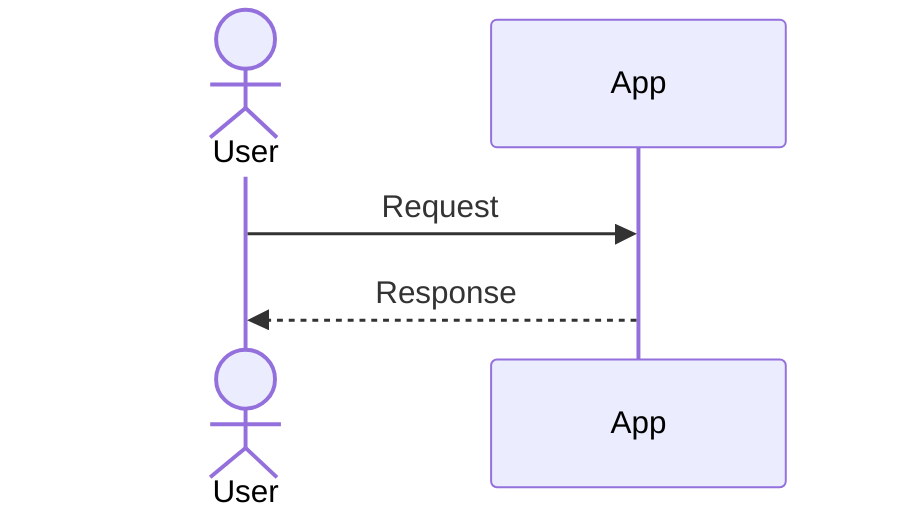
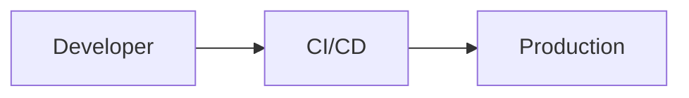

# {{Product Name}} — System Design Document

| Field | Value |
|-------|-------|
| Project | {{Product Name}} |
| Document | System Design Document |
| Version | 0.1 (Draft) |
| Date | {{YYYY-MM-DD}} |
| Prepared by | Generated with Claude, reviewed by {{name / [TBD]}} |
| Status | Draft |
| Source revision | Brief v{{n}}, {{YYYY-MM-DD}} |

## Table of Contents

## Read This First
<!-- Plain-language entry page (rules/35-readability.md).
     The system in one picture; the main parts in a plain table (what it is, where it runs, what it does); the case flow; a 'Where to Find What' table.
     Add an 'In short' note under every numbered ## section:
     > [!NOTE]
     > **In short:** <one or two plain sentences> -->

## 1. Introduction
### 1.1 Purpose and Audience
### 1.2 Design Goals
<!-- The 3–5 qualities the design optimizes for, tied to NFR IDs. -->
### 1.3 Related Documents
<!-- Project Brief, Requirements Specification, Project Plan, Test Plan. -->

## 2. Architecture Overview
### 2.1 Architecture Style
<!-- e.g. modular monolith, client–server SPA + REST API. State why. -->
### 2.2 Context Diagram
```mermaid
flowchart LR
    User[User roles] --> App[{{Product}}]
    App --> Ext[External systems]
```
### 2.3 Container / Component Diagram

### 2.4 Components
| Component | Responsibility | Technology | Implements |
|-----------|----------------|------------|------------|
| | | | FR-01, FR-02 |

## 3. Technology Stack
| Layer | Technology | Version | Status | Reason |
|-------|------------|---------|--------|--------|
| Frontend | | | Proposed / Agreed | |
| Backend | | | | |
| Database | | | | |
| Authentication | | | | |
| Hosting | | | | |
| CI/CD | | | | |
| Testing | | | | |

## 4. Data Design
### 4.1 Entity Relationship Diagram

### 4.2 Entities
| Entity | Attribute | Type | Required | Notes |
|--------|-----------|------|----------|-------|
### 4.3 Data Retention and Archiving

## 5. API Design
<!-- Proposed endpoints. Final paths are confirmed during development. -->
| Method | Path | Purpose | Roles | Implements |
|--------|------|---------|-------|------------|
| GET | /api/{{resource}} | | | FR-01 |
### 5.1 Conventions
<!-- Versioning, error format, pagination, authentication header. -->

## 6. User Interface Design
### 6.1 Screen Inventory
| Screen ID | Screen | Purpose | Roles | Implements |
|-----------|--------|---------|-------|------------|
| S-01 | | | | FR-01 |
### 6.2 Navigation Map

### 6.3 Key Screen Descriptions
<!-- Fields, actions, and validation per important screen. Wireframes: [TBD]. -->

## 7. Roles and Permissions
| Action / Resource | R-01 | R-02 | R-03 |
|-------------------|------|------|------|
| | ✅ | ❌ | ✅ |

## 8. Integration Design
| Integration | Protocol | Auth | Data | Error handling |
|-------------|----------|------|------|----------------|

## 9. Key Processes
<!-- Sequence diagrams for the 2–4 most important workflows. -->


## 10. Security Design
| Area | Design | Implements |
|------|--------|------------|
| Authentication | | NFR-03 |
| Authorization | | |
| Password storage | | |
| Data in transit | | |
| Data at rest | | |
| Input validation | | |
| Audit logging | | |
| Secrets management | | |

## 11. Error Handling and Logging

## 12. Deployment Architecture
### 12.1 Environments
| Environment | Purpose | Hosting | Who uses it |
|-------------|---------|---------|-------------|
| Development | | | |
| Test / Staging | | | |
| Production | | | |
### 12.2 Deployment Diagram

### 12.3 Backup and Recovery Design

## 13. Configuration (planned)
| Key | Purpose | Example / Default | Secret? |
|-----|---------|-------------------|---------|

## 14. Proposed Repository Structure
```text
{{tree with one-line purpose per folder}}
```

## 15. Architecture Decision Records
### ADR-01: {{Decision title}}
- **Status:** Proposed / Accepted
- **Context:** {{...}}
- **Decision:** {{...}}
- **Alternatives considered:** {{...}}
- **Consequences:** {{...}}

## 16. Design Risks and Open Questions

## Open Items
| Marker | Item | Needed from |
|--------|------|-------------|

## Revision History
| Version | Date | Author | Changes |
|---------|------|--------|---------|
| 0.1 | {{date}} | {{author}} | Initial draft |
