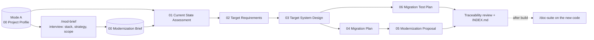

# Mode C — Modernize an Existing Project

Use this mode when a project **already exists and has been documented with Mode A**, and
you want to **rebuild, modernize, or optimize it as a new project**. Claude reads the
Mode A Project Profile (what exists today), interviews you about the target tech stack,
the migration strategy, and what to keep, improve, replace, or drop, and then produces
the documents a team needs to plan the modernization. Documents only, no application code.

## Commands
| Command | Output (`output/mode-c/<slug>/`) |
|---------|----------------------------------|
| `/mod-brief <mode-a slug or code path> [name]` | `00-modernization-brief.md` (evidence base, from the profile plus a short interview) |
| `/mod-assessment <slug>` | `01-current-state-assessment.md` |
| `/mod-requirements <slug>` | `02-target-requirements-specification.md` |
| `/mod-design <slug> [stack/hosting]` | `03-target-system-design.md` |
| `/mod-plan <slug> [start/deadline/team]` | `04-migration-plan.md` |
| `/mod-proposal <slug> [client/budget/rates]` | `05-modernization-proposal.md` |
| `/mod-test-plan <slug>` | `06-migration-test-plan.md` |
| `/mod-suite <mode-a slug or code path> [change] [--only ...] [--format docx\|pdf]` | All of the above + `INDEX.md`, Word files, a presentation deck (`deck/`, PowerPoint in `export/`), and `<repo>-repo-starter/` |

## Example
```text
/doc-intake D:/work/inventory-system
/mod-suite inventory-system
```

If no Mode A profile exists yet, `/mod-brief` runs `/doc-intake` on the code path first.

## How it works


1. **Brief:** Claude copies the current facts from the profile, then asks all its
   questions in one message. The questions always cover the **target tech stack**, layer
   by layer, with the current technology shown next to each and a suggested default.
   Answer what you can, or reply `use defaults`.
2. **Assessment:** what is wrong with the current system today, with code evidence, and
   what works well and should survive.
3. **Documents:** requirements include **parity** requirements for every kept feature and
   one requirement per serious finding. The design shows the stack comparison and the
   old-to-new component and data mappings. The plan includes cutover, rollback, and
   decommission. The test plan includes parity, data migration, and cutover tests.
4. **Readable from the first draft:** every document opens with a plain-language
   **Read This First** page with process flows (case flow, SDLC flow, ready-to-deploy
   gate), and every section starts with an "In short" note. The interview also asks
   where the pilot runs, who tests, how approvers are named, and which words to avoid,
   so the first draft already follows them.
5. **Deck and build kit:** the suite ends with Word files, a presentation deck for the
   approvers, and a starter kit for the new code repository (CLAUDE.md, README, rules and
   Claude skills built from the documents, with the `/feature-dev` plugin enabled).
6. **Changes after review:** run `/mod-suite <slug> <change>`. It records the change in
   the brief and updates every document, the INDEX, the deck and the kit in order.
7. **Tech stack questionnaire:** every suite includes
   `07-tech-stack-questionnaire.md` (and its Word copy), with questions for stakeholders
   and for developers. Send it out; when the answers come back, run
   `/mod-suite <slug> <answers>`. The answers update the brief, and the suite carries them
   through every document.
8. **After you build it:** run the Mode A skills on the new code for the final manuals.

## Labels used in Mode C
| Label | Meaning |
|-------|---------|
| **Keep / Improve / Replace / Drop / New** | Disposition of each current feature in the target system |
| **Proposed** | Claude's suggestion (for example a target technology), with a reason. Confirm or change it. |
| `[DECISION: ...]` | You must choose between options (stack layer, migration strategy). Claude gives a recommendation. |
| `[TBD: ...]` | Information still needed (budget, dates, data volumes, names). |
| `[ASSUMPTION: ...]` | Inferred from the profile or what you said. Please confirm. |
| `[VERIFY: ...]` | Possibly stale (for example a vendor end-of-life date) or contradictory. |

## Contents of this folder
| Path | Purpose |
|------|---------|
| `templates/` | Document skeletons for Mode C (00–07) |
| `rules/30-evidence-from-profile.md` | Two subjects, two tenses: current system from the profile and code, target system from the brief |
| `rules/40-document-specific.md` | What each Mode C document must contain |
| `rules/50-readability-and-refinement.md` | Readability layer, standard process flows, wording and naming, testers and release gate, propagating changes, exports, slides |

Shared writing, formatting, and review rules live in the top-level `rules/` folder.
