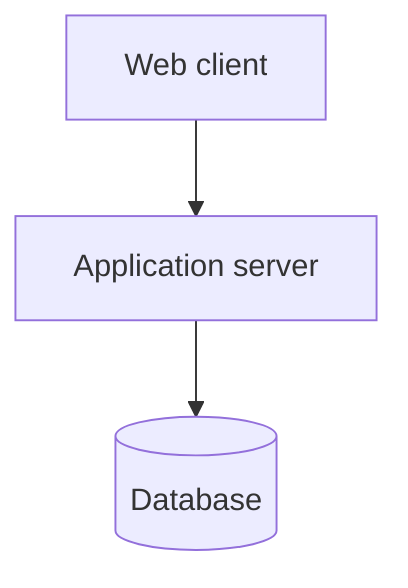
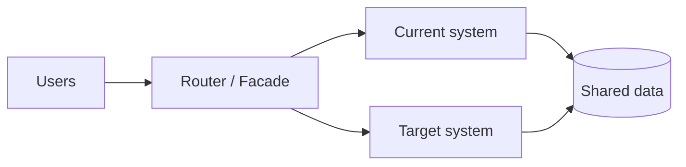
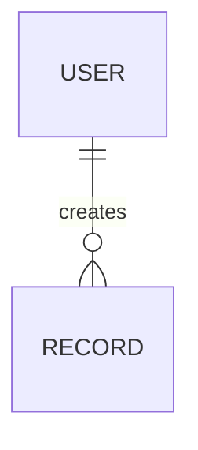
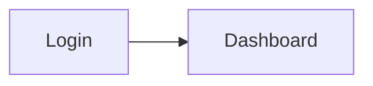
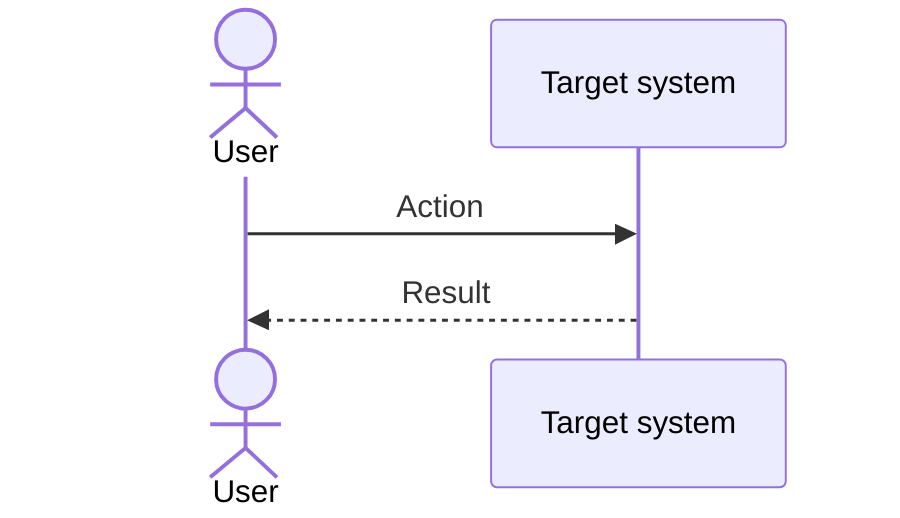
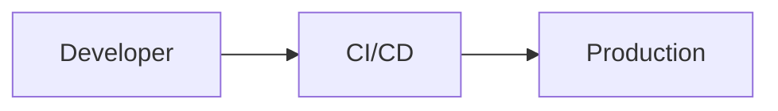

# {{Product Name}} — Target System Design Document

| Field | Value |
|-------|-------|
| Project | {{Product Name}} |
| Document | Target System Design Document |
| Version | 0.1 (Draft) |
| Date | {{YYYY-MM-DD}} |
| Prepared by | Generated with Claude, reviewed by {{name / [TBD]}} |
| Status | Draft |
| Source revision | Profile {{mode-a slug}} @ {{git SHA / "working copy, YYYY-MM-DD"}}; Modernization Brief v{{n}}, {{YYYY-MM-DD}} |

## Table of Contents

## Read This First
<!-- Plain-language entry page (mode-c-modernize-project/rules/50-readability-and-refinement.md sections 1 and 3).
     The system in one picture; the main parts in a plain table (what it is, where it runs, what it does); the case flow and one flow per special module with its safety check; a 'Where to Find What' table.
     Add an 'In short' note under every numbered ## section:
     > [!NOTE]
     > **In short:** <one or two plain sentences> -->

## 1. Introduction
### 1.1 Purpose and Audience
### 1.2 Design Goals
<!-- The 3–5 qualities the design optimizes for, tied to NFR IDs and assessment findings. -->
### 1.3 Related Documents
<!-- Mode A Profile, Modernization Brief, Current State Assessment, Target Requirements, Migration Plan, Migration Test Plan. -->

## 2. Architecture Overview
### 2.1 Current Architecture (as built)
<!-- Short, present tense, from the Assessment section 3. -->
### 2.2 Target Architecture Style
<!-- e.g. modular monolith, SPA + REST API. State why, and what it fixes (D-xx). -->
### 2.3 Context Diagram
```mermaid
flowchart LR
    User[User roles] --> App[{{Target system}}]
    App --> Ext[External systems]
```
### 2.4 Container / Component Diagram

### 2.5 Components
| Component | Responsibility | Technology | Implements | Resolves |
|-----------|----------------|------------|------------|----------|
| | | | FR-01, FR-02 | D-xx |

### 2.6 Interim Architecture (incremental strategy only)
<!-- How old and new run side by side: routing / facade, shared data, sync. Otherwise "Not applicable — big-bang strategy". -->


## 3. Stack Comparison
<!-- One row per layer. Every changed layer has an ADR; every kept layer says why it stays. -->
| Layer | Current (Profile section 3) | Target | Version | Status | Reason | ADR |
|-------|----------------------|--------|---------|--------|--------|-----|
| Language | | | | Agreed / Proposed | | ADR-01 |
| Backend framework | | | | | | |
| Frontend / UI | | | | | | |
| Database | | | | | | |
| Authentication | | | | | | |
| Hosting / Infra | | | | | | |
| CI/CD | | | | | | |
| Testing | | | | | | |

## 4. Component Mapping (current → target)
| Current module (Profile section 6) | Status today | Target component | Disposition | What changes |
|-----------------------------|--------------|------------------|-------------|--------------|
| | Done / Partial / Stub / Broken | | Keep / Improve / Replace / Drop | |

## 5. Data Design
### 5.1 Entity Relationship Diagram (target)

### 5.2 Entities
| Entity | Attribute | Type | Required | Notes |
|--------|-----------|------|----------|-------|
### 5.3 Data Mapping (current → target)
| Current entity / table (Profile section 10) | Target entity | Transformation | Migrated? | Notes |
|--------------------------------------|---------------|----------------|-----------|-------|
### 5.4 Data Retention and Archiving

## 6. API Design
| Method | Path | Roles | Implements | Replaces (Profile section 9.2) |
|--------|------|-------|------------|-------------------------|
### 6.1 Conventions
<!-- Versioning, error format, pagination, auth. -->

## 7. User Interface Design
### 7.1 Screen Inventory
| ID | Screen | Roles | Implements | Replaces (Profile section 9.1) |
|----|--------|-------|------------|-------------------------|
| S-01 | | | FR-01 | |
### 7.2 Navigation Map

### 7.3 Key Screen Descriptions

## 8. Roles and Permissions
| Permission | R-01 | R-02 |
|------------|------|------|

## 9. Integration Design
| System | Current method (Profile section 12) | Target method | Disposition | Notes |
|--------|------------------------------|---------------|-------------|-------|

## 10. Key Processes


## 11. Security Design
<!-- Must resolve the Security findings (D-xx) and the Security NFRs. -->

## 12. Error Handling, Logging, and Observability

## 13. Deployment Architecture
### 13.1 Environments
| Environment | Purpose | Hosting | Data |
|-------------|---------|---------|------|
### 13.2 Deployment Diagram

### 13.3 Backup and Recovery Design

## 14. Configuration (planned)
| Key | Purpose | Example (placeholder) | Current equivalent (Profile section 11) |
|-----|---------|-----------------------|----------------------------------|

## 15. Proposed Repository Structure
```text
{{target repository tree}}
```

## 16. Architecture Decision Records
### ADR-01: {{Decision title}}
- **Status:** Proposed / Agreed
- **Context:** {{current situation, finding D-xx}}
- **Options considered:** {{A / B / C}}
- **Decision:** {{choice}}
- **Reason:** {{why}}
- **Consequences:** {{what follows}}

## 17. Design Risks and Open Questions

## Open Items
| Marker | Item | Needed from |
|--------|------|-------------|

## Revision History
| Version | Date | Author | Changes |
|---------|------|--------|---------|
| 0.1 | {{date}} | {{author}} | Initial draft |
